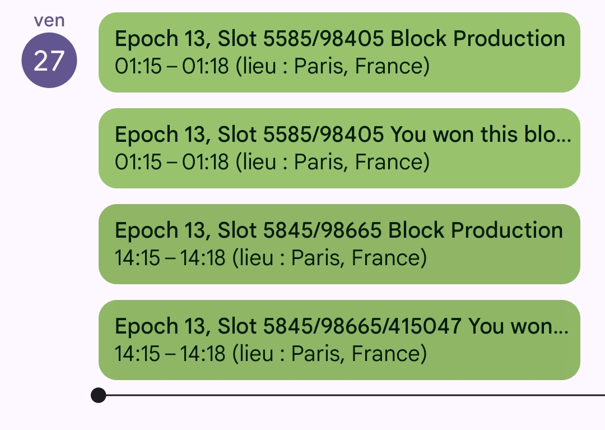
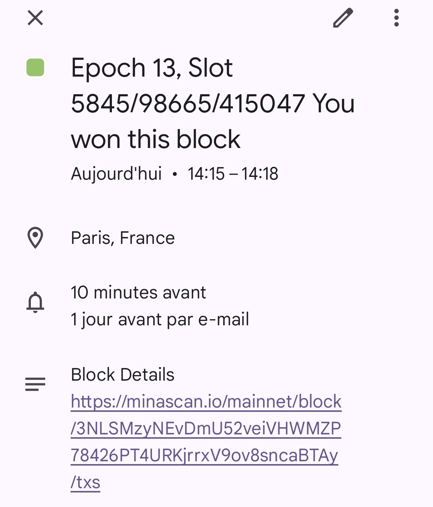

# block2gca
*Python script that adds the next block production slot event to google calendar* 




**NEVER MISS A BLOCK PRODUCTION SLOT AGAIN !!**

# Purpose
This little handy script gets the next block production slot timestamp from your local GraphQL server and adds it to the google calendar of your choice !  

# Prerequisites
* python3
* pip
* Google Python API : google-api-python-client

# Installation
## Google API python library
Install the required Google API python libraries  

```bash
pip install google-auth google-auth-oauthlib google-auth-httplib2 google-api-python-client
```
## Google API calendar oAuth2 access  

* Head over your Google Cloud Console : https://console.cloud.google.com/
* Connect to the google account linked to the calendar you want to add block production event to. (you can also create a dedicated google calendar to store block production events)
* Create a new project
* Activate Google Calendar API.
* Create your oAuth2 identifiers (type : Desktop Application).
* Download your credentials JSON file (credentials.json).
* Copy your `credentials.json` file in the same location as the script (`block2gca.py`)

## `config.json` 
This file will contains the required parameters to run the script.  

```json
{
  "LAST_PROCESSED_FILE": "{FULL_PATH_TO_STORE_LAST_PROCESSED_SLOT_TIMESTAMP}/last_processed.txt",
  "OUTPUT_FILE": "{FULL_PATH_TO_STORE_CURRENT_SLOT_TIMESTAMP}/timestamp.txt",
  "GRAPHQL_URL": "http://localhost:3085/graphql",
  "TOKEN_FILE": "{FULL_PATH_TO_GOOGLE_CALENDAR_API_OAUTH_TOKEN}/token.json",
  "CREDENTIALS_FILE": "{FULL_PATH_TO_GOOGLE_CALENDAR_API_CREDENTIALS}/credentials.json",
  "CALENDAR_ID": "{CALENDAR_ID}@group.calendar.google.com",
  "SCOPES": ["https://www.googleapis.com/auth/calendar"]
}
```
**LAST_PROCESSED_FILE**  
Full path to the file that will be generated by the script to compare next block production slot timestamp with the current one.  
Each time the next block production slot changes, then a new event will be added to your google calendar.  

**OUTPUT_FILE**  
Full path to the file that will be generated by the script with the current next block production slot timestamp  

**GRAPHQL_URL**  
You local GraphQL server URL  
  
**CREDENTIALS_FILE**  
Full path to the google calendar API credential file (generated in the previous step in the Google Cloud console)  
  
**TOKEN_FILE**  
Full path to the token file that will be generated by oAuth2 the first time the script is launched.  
This token will then be used by the script to call the Google API  
  
**CALENDAR_ID**  
Identifier of the calendar you want to add block production slot event to.  
  
**SCOPES**  
URL of the Google API  
  
# First launch  
When you run the script for the first time :   

```bash
# python3 block2gca.py --config ./config.json
```

it will open an oAuth2 authorization request in your web browser.  
Once the permission is granted, a `token.json` file will be created that will be used by the script for further Google API calls.  
  
The directory containing the script should then contain the following files :  

```bash
block2gca.py
config.json
credentials.json*
last_processed.txt
timestamp.txt
token.json*
```
Your next block production slot should then be added to your Google Calendar !!  

# Automate the script execution
You can launch the script manually whenever you want but you can also fully automate the script execution using `crontab`  
Edit your `crontab` :  

```bash
# crontab -e
```

Add the folowing line to your crontab so that the script is executed every minute :  

```
*/1 * * * * /usr/bin/python3 <FULL_PATH_TO_YOUR_SCRIPT>/block2gca.py --config <FULL_PATH_TO_CONFIG.JSON_FILE>
```


**AND NOW ENJOY GETTING YOUR BLOCK PRODUCTION SLOTS IN YOUR GOOGLE CALENDAR !!**


